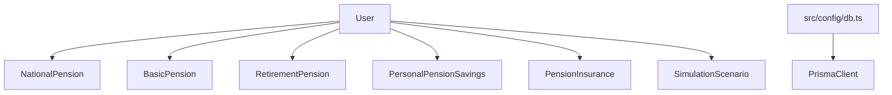

# Dependency Map

```mermaid
graph TD
  User --> NationalPension
  User --> BasicPension
  User --> RetirementPension
  User --> PersonalPensionSavings
  User --> PensionInsurance
  User --> SimulationScenario
  db[src/config/db.ts] --> PrismaClient
```
