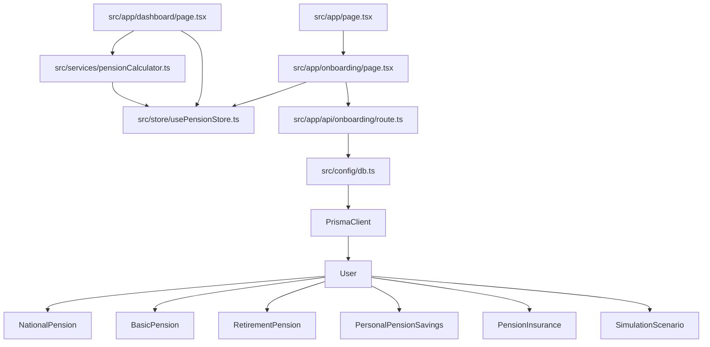

# Dependency Map

```mermaid
graph TD
  %% Database Layer
  db[src/config/db.ts] --> PrismaClient
  PrismaClient --> User
  User --> NationalPension
  User --> BasicPension
  User --> RetirementPension
  User --> PersonalPensionSavings
  User --> PensionInsurance
  User --> SimulationScenario

  %% State & Business Logic Layer
  Store[src/store/usePensionStore.ts]
  Calculator[src/services/pensionCalculator.ts]

  %% UI & Page Layer
  Landing[src/app/page.tsx] --> OnboardingUI
  OnboardingUI[src/app/onboarding/page.tsx] --> Store
  OnboardingUI --> OnboardingAPI[src/app/api/onboarding/route.ts]
  OnboardingAPI --> db

  Dashboard[src/app/dashboard/page.tsx] --> Store
  Dashboard --> Calculator
  Calculator --> Store
```
