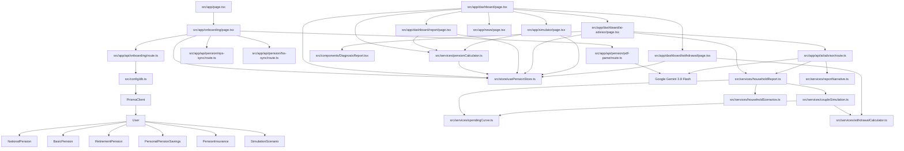

# Dependency Map

```mermaid
graph TD
  %% Database Layer
  db[src/config/db.ts] --> PrismaClient
  PrismaClient --> User
  User --> NationalPension
  User --> BasicPension
  User --> RetirementPension
  User --> PersonalPensionSavings
  User --> PensionInsurance
  User --> SimulationScenario

  %% State & Business Logic Layer
  Store[src/store/usePensionStore.ts]
  Calculator[src/services/pensionCalculator.ts]

  %% UI & Page Layer
  Landing[src/app/page.tsx] --> OnboardingUI
  OnboardingUI[src/app/onboarding/page.tsx] --> Store
  OnboardingUI --> OnboardingAPI[src/app/api/onboarding/route.ts]
  OnboardingAPI --> db

  Dashboard[src/app/dashboard/page.tsx] --> Store
  Dashboard --> Calculator
  Calculator --> Store

  %% Sprint 2 Additions
  Dashboard --> Report[src/app/dashboard/report/page.tsx]
  Report --> Store
  Report --> Calculator
  OnboardingUI --> NPSSyncAPI[src/app/api/pension/nps-sync/route.ts]
  OnboardingUI --> FSSSyncAPI[src/app/api/pension/fss-sync/route.ts]
  OnboardingUI --> PDFParseAPI[src/app/api/pension/pdf-parse/route.ts]
  PDFParseAPI --> GeminiAPI[Google Gemini API]

  %% AI Advisor & Spending Curve (Sprint 28)
  Dashboard --> AIAdvisor[src/app/dashboard/ai-advisor/page.tsx]
  AIAdvisor --> Store
  AIAdvisor --> DiagnosisReport[src/components/DiagnosisReport.tsx]
  AIAdvisor --> HouseholdReport[src/services/householdReport.ts]
  HouseholdReport --> SpendingCurve[src/services/spendingCurve.ts]
  HouseholdReport --> CoupleSim[src/services/coupleSimulation.ts]
  HouseholdReport --> Scenarios[src/services/householdScenarios.ts]
  CoupleSim --> SpendingCurve
  CoupleSim --> WithdrawalCalc[src/services/withdrawalCalculator.ts]
  AIAdvisor --> AIAdvisorAPI[src/app/api/ai/advisor/route.ts]
  AIAdvisorAPI --> HouseholdReport
  AIAdvisorAPI --> ReportNarrative[src/services/reportNarrative.ts]
  AIAdvisorAPI --> GeminiAPI[Google Gemini 3.8 Flash]


  %% Simulator & News Routes (404 Bug Fixes)
  Dashboard --> Simulator[src/app/simulator/page.tsx]
  Dashboard --> News[src/app/news/page.tsx]
  Simulator --> Store
  Simulator --> Calculator

  %% Withdrawal Strategy (Sprint 19)
  Dashboard --> WithdrawalUI[src/app/dashboard/withdrawal/page.tsx]
  WithdrawalUI --> Store
  WithdrawalUI --> WithdrawalCalc[src/services/withdrawalCalculator.ts]
```
