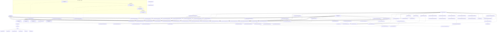

# Dependency Map

```mermaid
graph TD
  %% Database Layer
  db[src/config/db.ts] --> PrismaClient
  PrismaClient --> User
  User --> NationalPension
  User --> BasicPension
  User --> RetirementPension
  User --> PersonalPensionSavings
  User --> PensionInsurance
  User --> SimulationScenario

  %% State & Business Logic Layer
  Store[src/store/usePensionStore.ts]
  Calculator[src/services/pensionCalculator.ts]

  %% UI & Page Layer
  Landing[src/app/page.tsx] --> OnboardingUI
  OnboardingUI[src/app/onboarding/page.tsx] --> Store
  OnboardingUI --> OnboardingAPI[src/app/api/onboarding/route.ts]
  OnboardingAPI --> db

  Dashboard[src/app/dashboard/page.tsx] --> Store
  Dashboard --> Calculator
  Calculator --> Store
  PersonaModal[src/components/PersonaPresetModal.tsx] --> Personas[src/config/personas.ts]
  PersonaModal --> Store
  Dashboard --> PersonaModal
  OnboardingUI --> PersonaModal
  AIAdvisor --> PersonaModal

  %% Sprint 31 Additions (BEP Modal, Engine & CSV Export)
  Dashboard --> CoupleSimSec[src/components/CoupleSimulationSection.tsx]
  Dashboard --> NpsBepModal[src/components/NpsEarlyDeferralModal.tsx]
  CoupleSimSec --> NpsBepModal
  NpsBepModal --> NpsBepCalc[src/services/npsEarlyDeferralBep.ts]
  NpsBepCalc --> NpsRules[src/config/npsRules.ts]
  CoupleSimSec --> ExportCsv[src/utils/exportCsv.ts]
  Dashboard --> ExportCsv

  %% Sprint 32 Additions (Defense & Tax Tools)
  Dashboard --> Tax15Modal[src/components/PrivatePensionTaxModal.tsx]
  Tax15Modal --> Tax15Calc[src/services/privatePensionTaxOptimizer.ts]
  Dashboard --> HealthBillModal[src/components/HealthInsuranceBillModal.tsx]
  HealthBillModal --> HealthBillCalc[src/services/localHealthInsuranceCalculator.ts]
  Dashboard --> ReverseMortgageModal[src/components/ReverseMortgageModal.tsx]
  ReverseMortgageModal --> ReverseMortgageCalc[src/services/reverseMortgageCalculator.ts]
  CoupleSim --> ReverseMortgageCalc

  %% Sprint 33 Additions (Income Bridge, Survivor Care, ISA Transfer)
  Dashboard --> IncomeBridgeModal[src/components/IncomeBridgeModal.tsx]
  IncomeBridgeModal --> IncomeBridgeCalc[src/services/incomeBridgeCalculator.ts]
  Dashboard --> SurvivorCareModal[src/components/SurvivorCareModal.tsx]
  SurvivorCareModal --> SurvivorCareCalc[src/services/survivorCareCalculator.ts]
  Dashboard --> IsaTransferModal[src/components/IsaPensionTransferModal.tsx]
  IsaTransferModal --> IsaTransferCalc[src/services/isaPensionTransferCalculator.ts]


  %% Sprint 2 Additions
  Dashboard --> Report[src/app/dashboard/report/page.tsx]
  Report --> Store
  Report --> Calculator
  OnboardingUI --> NPSSyncAPI[src/app/api/pension/nps-sync/route.ts]
  OnboardingUI --> FSSSyncAPI[src/app/api/pension/fss-sync/route.ts]
  OnboardingUI --> PDFParseAPI[src/app/api/pension/pdf-parse/route.ts]
  PDFParseAPI --> GeminiAPI[Google Gemini API]

  %% AI Advisor & Spending Curve (Sprint 28)
  Dashboard --> AIAdvisor[src/app/dashboard/ai-advisor/page.tsx]
  AIAdvisor --> Store
  AIAdvisor --> DiagnosisReport[src/components/DiagnosisReport.tsx]
  AIAdvisor --> HouseholdReport[src/services/householdReport.ts]
  HouseholdReport --> SpendingCurve[src/services/spendingCurve.ts]
  HouseholdReport --> CoupleSim[src/services/coupleSimulation.ts]
  HouseholdReport --> Scenarios[src/services/householdScenarios.ts]
  CoupleSim --> SpendingCurve
  CoupleSim --> WithdrawalCalc[src/services/withdrawalCalculator.ts]
  AIAdvisor --> AIAdvisorAPI[src/app/api/ai/advisor/route.ts]
  AIAdvisorAPI --> HouseholdReport
  AIAdvisorAPI --> ReportNarrative[src/services/reportNarrative.ts]
  AIAdvisorAPI --> GeminiAPI[Google Gemini 3.8 Flash]


  %% Simulator & News Routes (404 Bug Fixes)
  Dashboard --> Simulator[src/app/simulator/page.tsx]
  Dashboard --> News[src/app/news/page.tsx]
  Simulator --> Store
  Simulator --> Calculator

  %% Withdrawal Strategy (Sprint 19)
  Dashboard --> WithdrawalUI[src/app/dashboard/withdrawal/page.tsx]
  WithdrawalUI --> Store
  WithdrawalUI --> WithdrawalCalc[src/services/withdrawalCalculator.ts]

  %% Motion & Transitions (Sprint 37)
  Motion[src/components/motion/index.ts]
  Motion --> NumberPopIn[src/components/motion/NumberPopIn.tsx]
  Motion --> SlidingTabs[src/components/motion/SlidingTabs.tsx]
  Motion --> CopyCheckButton[src/components/motion/CopyCheckButton.tsx]
  Motion --> CardTilt[src/components/motion/CardTilt.tsx]
  Motion --> AiThinkingStream[src/components/motion/AiThinkingStream.tsx]
  Dashboard --> Motion
  DividendModal[src/components/DividendStrategyModal.tsx] --> Motion
  Landing --> Motion
  OnboardingUI --> Motion
  AIAdvisor --> Motion

  %% Portfolio Backtest (Sprint 38)
  Dashboard --> PortfolioBacktestModal[src/components/PortfolioBacktestModal.tsx]
  AIAdvisor --> PortfolioBacktestModal
  PortfolioBacktestModal --> PortfolioBacktestCalc[src/services/portfolioBacktest.ts]
  PortfolioBacktestModal --> Motion

  %% News & Media (Sprint 39)
  News[src/app/news/page.tsx] --> NewsAPI[src/app/api/news/route.ts]
  News --> NewsProxyAPI[src/app/api/news/proxy/route.ts]
  YouTube[src/app/youtube/page.tsx] --> YouTubeAPI[src/app/api/youtube/route.ts]

  %% Sprint 41 Additions (3 Killer Features: DB/DC Transition, 3-Bucket, Pension Transfer)
  DbDcModal[src/components/DbDcTransitionModal.tsx] --> DbDcCalc[src/services/dbDcTransitionCalculator.ts]
  ThreeBucketModal[src/components/ThreeBucketPlanModal.tsx] --> ThreeBucketCalc[src/services/threeBucketCalculator.ts]
  TransferBenefitModal[src/components/PensionTransferBenefitModal.tsx] --> TransferBenefitCalc[src/services/pensionTransferCalculator.ts]

  Dashboard --> DbDcModal
  Dashboard --> ThreeBucketModal
  Dashboard --> TransferBenefitModal

  Landing --> DbDcModal
  Landing --> ThreeBucketModal
  Landing --> TransferBenefitModal

  OnboardingUI --> DbDcModal
  OnboardingUI --> ThreeBucketModal
  OnboardingUI --> TransferBenefitModal

  AIAdvisor --> DbDcModal
  AIAdvisor --> ThreeBucketModal
  AIAdvisor --> TransferBenefitModal
  DiagnosisReport --> DbDcModal
  DiagnosisReport --> ThreeBucketModal
  DiagnosisReport --> TransferBenefitModal

  %% Sprint 42 Additions (Roadmap, Scenario Comparison, Account Tax Matrix, PWA)
  RoadmapModal[src/components/RetirementRoadmapModal.tsx] --> RoadmapCalc[src/services/retirementRoadmapService.ts]
  ScenarioModal[src/components/ScenarioComparisonModal.tsx] --> ScenarioCalc[src/services/scenarioComparisonService.ts]
  TaxMatrixModal[src/components/AccountTaxMatrixModal.tsx] --> TaxMatrixCalc[src/services/accountTaxMatrixService.ts]

  Dashboard --> RoadmapModal
  Dashboard --> ScenarioModal
  Dashboard --> TaxMatrixModal

  Landing --> RoadmapModal
  Landing --> ScenarioModal
  Landing --> TaxMatrixModal

  AIAdvisor --> RoadmapModal
  AIAdvisor --> ScenarioModal
  AIAdvisor --> TaxMatrixModal
  DiagnosisReport --> RoadmapModal

  %% Sprint 43 Additions (Cashflow Tracker, Interactive Advisor, FSS Excel Parser, Dynamic Modal Manager)
  CashflowModal[src/components/CashflowTrackerModal.tsx] --> CashflowCalc[src/services/cashflowTrackerService.ts]
  InteractiveAdvisorModal[src/components/InteractiveChatAdvisorModal.tsx] --> InteractiveAdvisorCalc[src/services/interactiveAdvisorService.ts]
  InteractiveAdvisorModal --> InteractiveAdvisorAPI[src/app/api/ai/interactive-advisor/route.ts]
  FssUploadPanel[src/components/FssUploadPanel.tsx] --> FssExcelParser[src/services/fssExcelParser.ts]
  ModalManager[src/components/DashboardModalManager.tsx] --> CashflowModal
  ModalManager --> InteractiveAdvisorModal
  Dashboard --> ModalManager
  Landing --> CashflowModal
  Landing --> InteractiveAdvisorModal

  %% Sprint 44 Additions (Tax/Health Statement, Dividend Calendar, Share Snapshot, Stress Test)
  TaxHealthModal[src/components/TaxAndHealthStatementModal.tsx] --> TaxHealthCalc[src/services/taxAndHealthStatementService.ts]
  DividendCalModal[src/components/DividendCalendarModal.tsx] --> DividendCalCalc[src/services/dividendCalendarService.ts]
  ShareSnapshotModal[src/components/ShareSnapshotModal.tsx] --> ShareSnapshotService[src/services/shareSnapshotService.ts]
  StressTestModal[src/components/StressTestModal.tsx] --> StressTestCalc[src/services/stressTestEngine.ts]

  ModalManager --> TaxHealthModal
  ModalManager --> DividendCalModal
  ModalManager --> ShareSnapshotModal
  ModalManager --> StressTestModal

  Landing --> TaxHealthModal
  Landing --> DividendCalModal
  Landing --> ShareSnapshotModal
  Landing --> StressTestModal

  AIAdvisor --> TaxHealthModal
  AIAdvisor --> DividendCalModal
  AIAdvisor --> ShareSnapshotModal
  AIAdvisor --> StressTestModal

  %% Sprint 45/50 Additions (NPS Recovery, Rebalancing Orders, Instant Onboarding)
  NpsRecoveryModal[src/components/NpsRecoveryModal.tsx] --> NpsRecoveryCalc[src/services/npsRecoveryCalculator.ts]
  NpsRecoveryModal --> Store
  RebalancingOrderModal[src/components/RebalancingOrderModal.tsx] --> RebalancingOrderService[src/services/rebalancingOrderService.ts]

  ModalManager --> NpsRecoveryModal
  ModalManager --> RebalancingOrderModal
  DashboardSidebar[src/components/DashboardSidebar.tsx] --> NpsRecoveryModal
  DashboardSidebar --> RebalancingOrderModal
  OnboardingUI --> FssExcelParser

  %% 4-Stage Agent Architecture (Agent Definition.md)
  subgraph AgentPipeline [4단계 전문 에이전트 파이프라인]
    Agent1[Agent 1: Pension Data Harvester] -->|NormalizedProfile| Agent2[Agent 2: Actuarial & Tax Specialist]
    Agent2 -->|SimulationResult| Agent3[Agent 3: Retirement Strategy Analyzer]
    Agent3 -->|StrategyDiagnosis| Agent4[Agent 4: AI Diagnostic Advisor]
  end
  Agent1 -.-> OnboardingUI
  Agent1 -.-> Store
  Agent2 -.-> Calculator
  Agent2 -.-> TaxHealthCalc
  Agent3 -.-> RebalancingOrderService
  Agent3 -.-> StressTestCalc
  Agent4 -.-> AIAdvisor
```

